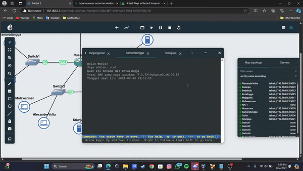

# LAPORAN RESMI MODUL 02 KOMUNIKASI DATA DAN JARINGAN KOMPUTER

## Kelompok IT40

### Anggota Kelompok :

| Nama                          | NRP        |
| ----------------------------- | ---------- |
| Revalina Fairuzy Azhari Putri | 5027231001 |
| Kevin Anugerah Faza           | 5027231027 |

_Sebuah kerajaan besar di Indonesia sedang mengalami pertempuran dengan penjajah. Kerajaan tersebut adalah Sriwijaya. Karena merasa terdesak Sriwijaya meminta bantuan pada Majapahit untuk mempertahankan wilayahnya. Pertempuran besar tersebut berada di Nusantara. Untuk topologi lihat pada link ini_

# Soal 1

> Untuk mempersiapkan peperangan World War MMXXIV (Iya sebanyak itu), Sriwijaya membuat dua kotanya menjadi web server yaitu Tanjungkulai, dan Bedahulu, serta Sriwijaya sendiri akan menjadi DNS Master. Kemudian karena merasa terdesak, Majapahit memberikan bantuan dan menjadikan kerajaannya (Majapahit) menjadi DNS Slave.

Topologi Jaringan


**Network Config.**

**Nusantara (Router)**

```
auto eth0
iface eth0 inet dhcp
        up iptables -t nat -A POSTROUTING -o eth0 -j MASQUERADE

auto eth1
iface eth1 inet static
	address 10.83.1.1
	netmask 255.255.255.0

auto eth2
iface eth2 inet static
	address 10.83.2.1
	netmask 255.255.255.0

auto eth3
iface eth3 inet static
	address 10.83.3.1
	netmask 255.255.255.0
```

**Client**

- Samaratungga

```
auto eth0
iface eth0 inet static
	address 10.83.1.2
	netmask 255.255.255.0
	gateway 10.83.1.1
```

- Mulawarman

```
auto eth0
iface eth0 inet static
	address 10.83.3.2
	netmask 255.255.255.0
	gateway 10.83.3.1
```

- AlexanderVolta

```
auto eth0
iface eth0 inet static
	address 10.83.3.3
	netmask 255.255.255.0
	gateway 10.83.3.1
  up echo nameserver 10.83.3.5 > /etc/resolv.conf
  up echo nameserver 10.83.2.2 > /etc/resolv.conf
	up echo nameserver 192.168.122.1 > /etc/resolv.conf
```

- Balaraja

```
auto eth0
iface eth0 inet static
	address 10.83.3.4
	netmask 255.255.255.0
	gateway 10.83.3.1
```

**Solok (Load Balancer)**

```
auto eth0
iface eth0 inet static
	address 10.83.1.3
	netmask 255.255.255.0
	gateway 10.83.1.1
	up echo nameserver 192.168.122.1 > /etc/resolv.conf
```

**Server**

- Sriwijaya

```
auto eth0
iface eth0 inet static
	address 10.83.3.5
	netmask 255.255.255.0
	gateway 10.83.3.1
	up echo nameserver 192.168.122.1 > /etc/resolv.conf
```

- Majapahit

```
auto eth0
iface eth0 inet static
	address 10.83.2.2
	netmask 255.255.255.0
	gateway 10.83.2.1
	up echo nameserver 192.168.122.1 > /etc/resolv.conf
```

**Web Server**

- Kotalingga

```
auto eth0
iface eth0 inet static
	address 10.83.3.6
	netmask 255.255.255.0
	gateway 10.83.3.1
	up echo nameserver 192.168.122.1 > /etc/resolv.conf
```

- Bedahulu

```
auto eth0
iface eth0 inet static
	address 10.83.2.4
	netmask 255.255.255.0
	gateway 10.83.2.1
	up echo nameserver 192.168.122.1 > /etc/resolv.conf
```

- Tanjungkulai

```
auto eth0
iface eth0 inet static
	address 10.83.2.3
	netmask 255.255.255.0
	gateway 10.83.2.1
	up echo nameserver 192.168.122.1 > /etc/resolv.conf
```

Setelah membuat semua konfigurasi untuk network yang ada, sambungkan local network dengan Nusantara menggunakan command :
`iptables -t nat -A POSTROUTING -o eth0 -j MASQUERADE -s 192.168.0.0/16`

Lakukan ping apakah clients telah terintegrasi dengan NAT dan Local Network


# Soal 2

> Karena para pasukan membutuhkan koordinasi untuk melancarkan serangannya, maka buatlah sebuah domain yang mengarah ke Solok dengan alamat sudarsana.xxxx.com dengan alias www.sudarsana.xxxx.com, dimana xxxx merupakan kode kelompok. Contoh: sudarsana.it01.com.

Buat sebuah script pada DNS Master untuk menyimpan konfigurasi sudarsana.xxxx.com yang diminta, yaitu :

```
#!/bin/bash

# Buat domain sudarsana.it40.com
echo 'zone "sudarsana.it40.com" {
	type master;
	file "/etc/bind/jarkom/sudarsana.it40.com";
};' > /etc/bind/named.conf.local

mkdir /etc/bind/jarkom

cp /etc/bind/db.local /etc/bind/jarkom/sudarsana.it40.com

echo '
;
; BIND data file for local loopback interface
;
$TTL    604800
@       IN      SOA     sudarsana.it40.com. sudarsana.it40.com. (
                        2024050301      ; Serial
                         604800         ; Refresh
                          86400         ; Retry
                        2419200         ; Expire
                         604800 )       ; Negative Cache TTL
;
@       IN      NS      sudarsana.it40.com.
@       IN      A       10.83.3.6     ; IP Kotalingga
www     IN      CNAME   sudarsana.it40.com.' > /etc/bind/jarkom/sudarsana.it40.com

service bind9 restart
```

# Soal 3

> Para pasukan juga perlu mengetahui mana titik yang akan diserang, sehingga dibutuhkan domain lain yaitu pasopati.xxxx.com dengan alias www.pasopati.xxxx.com yang mengarah ke Kotalingga.

Buat lagi sebuah script pada DNS Master untuk menyimpan konfigurasi pasopati yang diminta, yaitu :

```
#!/bin/bash

# Buat domain pasopati.it40.com
echo 'zone "pasopati.it40.com" {
	type master;
	file "/etc/bind/jarkom/pasopati.it40.com";
};' > /etc/bind/named.conf.local

mkdir /etc/bind/jarkom

cp /etc/bind/db.local /etc/bind/jarkom/pasopati.it40.com

echo '
;
; BIND data file for local loopback interface
;
$TTL    604800
@       IN      SOA     pasopati.it40.com. root.pasopati.it40.com. (
                        2024050301      ; Serial
                         604800         ; Refresh
                          86400         ; Retry
                        2419200         ; Expire
                         604800 )       ; Negative Cache TTL
;
@       IN      NS      pasopati.it40.com.
@       IN      A       10.83.3.6     ; IP Kotalingga
www     IN      CNAME   pasopati.it40.com.' > /etc/bind/jarkom/pasopati.it40.com

service bind9 restart
```

# Soal 4

> Markas pusat meminta dibuatnya domain khusus untuk menaruh informasi persenjataan dan suplai yang tersebar. Informasi dan suplai meme terbaru tersebut mengarah ke Tanjungkulai dan domain yang ingin digunakan adalah rujapala.xxxx.com dengan alias www.rujapala.xxxx.com.

Buat lagi sebuah script untuk menyimpan konfigurasi rujapala yang diminta, yaitu :

```
#!/bin/bash

# Buat domain rujapala.it40.com
echo 'zone "rujapala.it40.com" {
	type master;
	file "/etc/bind/jarkom/rujapala.it40.com";
};' > /etc/bind/named.conf.local

mkdir /etc/bind/jarkom

cp /etc/bind/db.local /etc/bind/jarkom/rujapala.it40.com

echo '
;
; BIND data file for local loopback interface
;
$TTL    604800
@       IN      SOA     rujapala.it40.com. rujapala.it40.com. (
                        2024050301      ; Serial
                         604800         ; Refresh
                          86400         ; Retry
                        2419200         ; Expire
                         604800 )       ; Negative Cache TTL
;
@       IN      NS      rujapala.it40.com.
@       IN      A       10.83.3.6     ; IP Kotalingga
www     IN      CNAME   rujapala.it40.com.' > /etc/bind/jarkom/rujapala.it40.com

service bind9 restart
```

# Soal 5

> Pastikan domain-domain tersebut dapat diakses oleh seluruh komputer (client) yang berada di Nusantara.

Testing ping ke semua domain yang telah dibuat


# Soal 6

> Beberapa daerah memiliki keterbatasan yang menyebabkan hanya dapat mengakses domain secara langsung melalui alamat IP domain tersebut. Karena daerah tersebut tidak diketahui secara spesifik, pastikan semua komputer (client) dapat mengakses domain pasopati.xxxx.com melalui alamat IP Kotalingga (Notes: menggunakan pointer record).

Pada DNS Master lakukan konfigurasi dengan melakukan pengubahan pada named.conf.local dan in-addr.arpa seperti pada konfigurasi berikut (membalik IP server Sriwijaya, yang awalnya `10.83.3' menjadi '3.83.10') :

```
#!/bin/bash

# Buat reverse DNS (Record PTR)
echo 'zone "3.83.10.in-addr.arpa" {
    type master;
    file "/etc/bind/jarkom/3.83.10.in-addr.arpa";
};' >> /etc/bind/named.conf.local

cp /etc/bind/db.local /etc/bind/jarkom/3.83.10.in-addr.arpa

echo ';
;
; BIND data file for local loopback interface
;
$TTL    604800
@       IN      SOA     pasopati.it40.com. root.pasopati.it40.com. (
                        2024050301      ; Serial
                         604800         ; Refresh
   86400         ; Retry
                        2419200         ; Expire
                         604800 )       ; Negative Cache TTL
;
3.83.10.in-addr.arpa.    IN      NS      pasopati.it40.com.
3                       IN      PTR     pasopati.it40.com.' > /etc/bind/jarkom/3.83.10.in-addr.arpa

service bind9 restart
```

Setelah itu pada masing-masing client (Samaratungga, Mulawarman, AlexanderVolta, Balaraja) lakukan setup konfigurasi

```
# Set nameserver ke IP Nusantara
echo 'nameserver 192.168.122.1' > /etc/resolv.conf

# Install utils
apt-get update
apt-get install dnsutils -y

# Kembalikan nameserver ke Sriwijaya and Majapahit
echo '
nameserver 10.83.3.5
nameserver 10.83.2.2' > /etc/resolv.conf
```

Seusai semua berhasil terkonfigurasi, lakukan testing pada salah satu client


# Soal 7

> Akhir-akhir ini seringkali terjadi serangan brainrot ke DNS Server Utama, sebagai tindakan antisipasi kamu diperintahkan untuk membuat DNS Slave di Majapahit untuk semua domain yang sudah dibuat sebelumnya yang mengarah ke Sriwijaya.

Pada DNS Server (Sriwijaya) lakukan setup konfigurasi

```
#!/bin/bash

# Tambahkan kebutuhan untuk menjadi master Sriwijaya
echo '
zone "sudarsana.it40.com" {
        type master;
        notify yes;
        also-notify { 10.83.2.2; }; //IP Majapahit
        allow-transfer { 10.83.2.2; }; //IP Majapahit
        file "/etc/bind/jarkom/sudarsana.it40.com";
};

zone "pasopati.it40.com" {
        type master;
        notify yes;
        also-notify { 10.83.2.2; }; //IP Majapahit
        allow-transfer { 10.83.2.2; }; //IP Majapahit
        file "/etc/bind/jarkom/pasopati.it40.com";
};

zone "rujapala.it40.com" {
        type master;
        notify yes;
        also-notify { 10.83.2.2; }; //IP Majapahit
        allow-transfer { 10.83.2.2; }; //IP Majapahit
        file "/etc/bind/jarkom/rujapala.it40.com";
};' > /etc/bind/named.conf.local

service bind9 restart
```

Lalu lakukan setup konfigurasi juga pada DNS Slave (Majapahit)

```
#!/bin/bash
# Cek apakah bind9 sudah terinstal
if ! command -v named &> /dev/null
then
    echo "Bind9 belum terinstal, melakukan instalasi..."
    # Melakukan instalasi bind9
    apt-get update
    apt-get install bind9 -y
else
    echo "Bind9 sudah terinstal."
fi

echo '
zone "sudarsana.it40.com" {
    type slave;
    masters { 10.83.3.5; }; // IP Sriwijaya
    file "/var/lib/bind/sudarsana.it40.com";
};

zone "pasopati.it40.com" {
    type slave;
    masters { 10.83.3.5; }; // IP Sriwijaya
    file "/var/lib/bind/pasopati.it40.com";
};

zone "rujapala.it40.com" {
 type slave;
    masters { 10.83.3.5; }; // IP Sriwijaya
    file "/var/lib/bind/rujapala.it40.com";
};' > /etc/bind/named.conf.local

service bind9 restart
```

Setelah itu lakukan ping testing dengan menggunakan `ping pasopati.it40.com' pada masing-masing client


# Soal 8

> Kamu juga diperintahkan untuk membuat subdomain khusus melacak kekuatan tersembunyi di Ohio dengan subdomain cakra.sudarsana.xxxx.com yang mengarah ke Bedahulu.

Lakukan setup konfigurasi pada Sriwijaya (DNS Master)

```
#!/bin/bash

# Tambahkan konfigurasi untuk membuat subdomain cakra.sudarsana.it40.com
echo '
;
; BIND data file for local loopback interface
;
$TTL    604800
@       IN      SOA     sudarsana.it40.com. sudarsana.it40.com. (
                        2024050301      ; Serial
                         604800         ; Refresh
                          86400         ; Retry
                        2419200         ; Expire
                         604800 )       ; Negative Cache TTL
;
@       IN      NS      sudarsana.it40.com.
@       IN      A       10.83.1.3     ; IP Solok
www     IN      CNAME   sudarsana.it40.com.
cakra  IN      A       10.83.2.4     ; IP Bedahulu' > /etc/bind/jarkom/sudarsana.it40.com

service bind9 restart
```

Cek testing dengan mencoba menjalankan `cakra.sudarsana.it40.com` pada salah satu cliet


# Soal 9

> Karena terjadi serangan DDOS oleh shikanoko nokonoko koshitantan (NUN), sehingga sistem komunikasinya terhalang. Untuk melindungi warga, kita diperlukan untuk membuat sistem peringatan dari siren man oleh Frekuensi Freak dan memasukkannya ke subdomain panah.pasopati.xxxx.com dalam folder panah dan pastikan dapat diakses secara mudah dengan menambahkan alias www.panah.pasopati.xxxx.com dan mendelegasikan subdomain tersebut ke Majapahit dengan alamat IP menuju radar di Kotalingga.

Lakukan set up konfigurasi di Sriwijaya (DNS Master)

```
#!/bin/bash

# Tambahkan konfigurasi untuk delegasi panah.pasopati.it40.com ke Majapahit
echo '
;
; BIND data file for local loopback interface
;
$TTL    604800
@       IN      SOA     pasopati.it40.com. pasopati.it40.com. (
                        2024050301      ; Serial
                         604800         ; Refresh
                          86400         ; Retry
                        2419200         ; Expire
                         604800 )       ; Negative Cache TTL
;
@       IN      NS      pasopati.it40.com.
@       IN      A       10.83.3.6     ; IP Kotalingga
www     IN      CNAME   pasopati.it40.com.
ns1     IN      A       10.83.2.2     ; Terusin ke Majapahit
panah   IN      NS      ns1' > /etc/bind/jarkom/pasopati.it40.com

echo '
options {
        directory "/var/cache/bind";

        //dnssec-validation auto;
        allow-query{any;};

        auth-nxdomain no;    # confirm to RFC1035
        listen-on-v6 { any; };
};' > /etc/bind/named.conf.options

service bind9 restart
```

Lakukan setup konfigurasi juga di Majapahit (DNS Slave)

```
#!/bin/bash

# Setup
echo '
options {
        directory "/var/cache/bind";

        //dnssec-validation auto;
        allow-query{any;};

        auth-nxdomain no;
        listen-on-v6 { any; };
};' > /etc/bind/named.conf.options

echo 'zone "panah.pasopati.it40.com" {
	type master;
	file "/etc/bind/panah/panah.pasopati.it40.com";
};' >> /etc/bind/named.conf.local

mkdir /etc/bind/panah

cp /etc/bind/db.local /etc/bind/panah/panah.pasopati.it40.com

echo '
;
; BIND data file for local loopback interface
;
$TTL    604800
@       IN      SOA     panah.pasopati.it40.com. root.panah.pasopati.it40.com. (
                        2024050301      ; Serial
                         604800         ; Refresh
                          86400         ; Retry
                        2419200         ; Expire
                         604800 )       ; Negative Cache TTL
;
@       IN      NS      panah.pasopati.it40.com.
@       IN      A       10.83.3.6     ; IP Kotalingga
www     IN      CNAME   panah.pasopati.it40.com.' > /etc/bind/panah/panah.pasopati.it40.com

service bind9 restart
```

Lakukan testing dengan melakukan 'ping panah.pasopati.it40.com' pada salah satu client


# Soal 10

> Markas juga meminta catatan kapan saja meme brain rot akan dijatuhkan, maka buatlah subdomain baru di subdomain panah yaitu log.panah.pasopati.xxxx.com serta aliasnya www.log.panah.pasopati.xxxx.com yang juga mengarah ke Kotalingga.

Buat konfigurasi script pada Majapahit (DNS Slave)

```
#!/bin/bash

# Tambahkan konfigurasi untuk membuat subdomain log.panah.pasopati.it40.com
echo '
;
; BIND data file for local loopback interface
;
$TTL    604800
@       IN      SOA     panah.pasopati.it40.com. panah.pasopati.it40.com. (
                        2024050301      ; Serial
                         604800         ; Refresh
                          86400         ; Retry
                        2419200         ; Expire
                         604800 )       ; Negative Cache TTL
;
@       IN      NS      panah.pasopati.it40.com.
@       IN      A       10.83.3.6     ; IP Kotalingga
www     IN      CNAME   panah.pasopati.it40.com.
log     IN      A       10.83.3.6     ; IP Kotalingga
www.log IN      CNAME   panah.pasopati.it40.com.' > /etc/bind/panah/panah.pasopati.it40.com

service bind9 restart
```

Lakukan testing pada salah satu client dengan command `ping log.panah.pasopati.it40.com`


# Soal 11

> Setelah pertempuran mereda, warga IT dapat kembali mengakses jaringan luar dan menikmati meme brainrot terbaru, tetapi hanya warga Majapahit saja yang dapat mengakses jaringan luar secara langsung. Buatlah konfigurasi agar warga IT yang berada diluar Majapahit dapat mengakses jaringan luar melalui DNS Server Majapahit.

Lakukan setup konfigurasi pada Sriwijaya (DNS Master)

```
#!/bin/bash

# Tambahkan konfigurasi untuk DNS forwarder
echo '
options {
        directory "/var/cache/bind";

        forwarders {
                192.168.122.1; //IP Nusantara
        };
        //dnssec-validation auto;
        allow-query{any;};

        auth-nxdomain no;
        listen-on-v6 { any; };
};' > /etc/bind/named.conf.options

service bind9 restart
```

Lakukan setup konfigurasi Majapahit (DNS Slave)

```
#!/bin/bash

# Tambahkan konfigurasi untuk DNS forwarder
echo '
options {
        directory "/var/cache/bind";

        forwarders {
                192.168.122.1; //IP Nusantara
        };
        //dnssec-validation auto;
        allow-query{any;};

        auth-nxdomain no;
        listen-on-v6 { any; };
};' > /etc/bind/named.conf.options

service bind9 restart
```

Lakukan testing dengan `ping www.google.com` pada salah satu client


# Soal 12

> Karena pusat ingin sebuah laman web yang ingin digunakan untuk memantau kondisi kota lainnya maka deploy laman web ini (cek resource yg lb) pada Kotalingga menggunakan apache.

Lakukan config network dengan menambahkan ip Kotalingga pada Sriwijaya (DNS Master)

```
#!/bin/bash

# Tambahkan nameserver Ip Kotalingga
echo '
nameserver 10.75.2.3' > /etc/resolv.conf
```

Setelah itu lakukan instalasi browser lynx pada setiap client

```
#!/bin/bash

# Lakukan instalasi browser Lynx
if ! command -v named &> /dev/null
then
    echo "Lynx belum ada, melakukan penginstalan..."

    # Melakukan instalasi lynx
    apt-get update
    apt-get install lynx -y
else
    echo "lynx sudah ada dan siap digunakan."
fi
```

Lakukan setup konfigurasi pada Kotalingga (Web Server)

```
#!/bin/bash

# Tambahkan konfigurasi agar bisa deploy

# Cek apakah apache2 sudah terinstal
if ! command -v named &> /dev/null
then
    echo "Apache2 belum ada, melakukan penginstalan..."
    # Melakukan instalasi apache2
    apt-get update
    apt-get install apache2 -y
    apt-get install libapache2-mod-php7.0 -y
else
    echo "apache2 sudah terinstal."
fi

# Cek apakah unzip sudah terinstal
if ! command -v named &> /dev/null
then
    echo "Unzip belum ada, melakukan penginstalan..."
    # Melakukan instalasi unzip
    apt-get update
    apt-get install unzip -y
else
    echo "unzip sudah terinstal."
fi

# Cek apakah php sudah terinstal
if ! command -v named &> /dev/null
then
    echo "PHP belum ada, melakukan penginstalan..."
    # Melakukan instalasi php
    apt-get update
    apt-get install php -y
else
    echo "php sudah terinstal."
fi

# Download file lb.zip
curl -k "https://drive.usercontent.google.com/download?id={1Sqf0TIiybYyUp5nyab4twy9svkgq8bi7}&confirm=xxx" -o lb.zip

# Unzip file lb.zip
unzip lb.zip

# Hapus file template
rm -rf /var/www/html/index.php

# Copy file index.php
cp worker/index.php /var/www/html/index.php

service apache2 restart
```

Lakukan testing pada masing-masing client dengan command `lynx http://10.83.3.6/index.php`


# Soal 13

> Karena Sriwijaya dan Majapahit memenangkan pertempuran ini dan memiliki banyak uang dari hasil penjarahan (sebanyak 35 juta, belum dipotong pajak) maka pusat meminta kita memasang load balancer untuk membagikan uangnya pada web nya, dengan Kotalingga, Bedahulu, Tanjungkulai sebagai worker dan Solok sebagai Load Balancer menggunakan apache sebagai web server nya dan load balancer nya.

Lakukan setup konfigurasi pada Sriwijaya (DNS Master) dan Majapahit (DNS Slave)

```
#!/bin/bash

# Tambahkan nameserver Ip Solok (LoadBalancer)
echo '
nameserver 192.168.122.1
nameserver 10.83.1.3' > /etc/resolv.conf
```

Lakukan setup konfigurasi pada Load Balancer (Solok)

```
#!/bin/bash

# Tambahkan keperluan untuk setting load balancer pada Solok

# Cek apakah apache2 wes onok bolo.
if ! command -v named &> /dev/null
then
    echo "Apache2 durung keinstall, utiwi get..."
    # Melakukan instalasi apache2
    apt-get update
    apt-get install apache2 -y
    apt-get install libapache2-mod-php7.0 -y
else
    echo "apache2 wes onok bolo.."
fi

# Cek apakah php wes onok bolo.
if ! command -v named &> /dev/null
then
    echo "PHP durung keinstall, utiwi get..."
    # Melakukan instalasi php
    apt-get update
    apt-get install php -y
else
    echo "php wes onok bolo.."
fi

# Enable apache2 module
a2enmod proxy_balancer
a2enmod proxy_http
a2enmod lbmethod_byrequests
echo '
<VirtualHost *:80>
    <Proxy balancer://serverpool>
        BalancerMember http://10.83.3.6/ #Kotalingga
        BalancerMember http://10.83.2.4/ #Bedahulu
        BalancerMember http://10.83.2.3/ #Tanjungkulai
        Proxyset lbmethod=byrequests
    </Proxy>
    ProxyPass / balancer://serverpool/
    ProxyPassReverse / balancer://serverpool/
</VirtualHost>' > /etc/apache2/sites-available/000-default.conf

service apache2 restart
```

Lakukan setup konfigurasi pada masing-masing Web Server / Worker yang ada (Kotalingga, Bedahulu, Tanjungkulai)

```
#!/bin/bash

# Tambahkan untuk keperluan load balancer
# Cek apakah apache2 sudah terinstal
if ! command -v named &> /dev/null
then
    echo "Apache2 belum terinstal, melakukan instalasi..."
    # Melakukan instalasi apache2
    apt-get update
    apt-get install apache2 -y
    apt-get install libapache2-mod-php7.0 -y
else
    echo "apache2 sudah terinstal."
fi

# Cek apakah unzip sudah terinstal
if ! command -v named &> /dev/null
then
    echo "Unzip belum terinstal, melakukan instalasi..."
    # Melakukan instalasi unzip
    apt-get update
    apt-get install unzip -y
else
    echo "unzip sudah terinstal."
fi

# Cek apakah php sudah terinstal
if ! command -v named &> /dev/null
then
    echo "PHP belum terinstal, melakukan instalasi..."
    # Melakukan instalasi php
    apt-get update
    apt-get install php -y
else
    echo "php sudah terinstal."
fi

# Download file lb.zip
curl -k "https://drive.usercontent.google.com/download?id={1Sqf0TIiybYyUp5nyab4twy9svkgq8bi7}&confirm=xxx" -o lb.zip

# Unzip file lb.zip
unzip lb.zip

# Hapus file template
rm -rf /var/www/html/index.php

# Copy file index.php
cp worker/index.php /var/www/html/index.php

service apache2 restart
```

Testing menggunakan salah satu client dengan command `lynx http://10.83.1.3/index.php`




# Soal 14
> Selama melakukan penjarahan mereka melihat bagaimana web server luar negeri, hal ini membuat mereka iri, dengki, sirik dan ingin flexing sehingga meminta agar web server dan load balancer nya diubah menjadi nginx.

Ubah konfigurasi pada semua web server / worker (Kotalingga, Bedahulu, Tanjungkulai)
```
service apache2 stop

apt install nginx php php-fpm -y

service php7.0-fpm start

echo 'server {
listen 80;

root /var/www/html;
index index.php index.html index.htm index.nginx-debian.html;

server_name _;

location / {
try_files $uri $uri/ /index.php?$query_string;
}

location ~ \.php$ {
include snippets/fastcgi-php.conf;
fastcgi_pass unix:/run/php/php7.0-fpm.sock;
}

location ~ /\.ht {
deny all;
}
}' > /etc/nginx/sites-enabled/default

service php7.0-fpm restart

service nginx restart
```

Lakukan juga pengubahan pada konfigurasi Load Balancer (Solok) 
```
service apache2 stop

#Lakukan instalasi php dan nginx
apt-get update
apt install nginx php php-fpm -y
apt-get install nginx -y

echo "upstream backend {
  server 10.83.3.6; # Kotalingga
  server 10.83.2.4; # Bedahulu
  server 10.83.2.3; # Tanjungkulai
}

server {
  listen 80;

  location / {
    proxy_pass http://backend;
  }
}
" > /etc/nginx/sites-enabled/default

service nginx restart
```

Lakukan testing pada salah satu client dengan `lynx http://10.83.1.3/index.php`
((GAMBAR))

# Soal 15
> Markas pusat meminta laporan hasil benchmark dengan menggunakan apache benchmark dari load balancer dengan 2 web server yang berbeda tersebut dan meminta secara detail dengan ketentuan:
> * Nama Algoritma Load Balancer
> * Report hasil testing apache benchmark 
> * Grafik request per second untuk masing masing algoritma. 
> * Analisis
> * Meme terbaik kalian (terserah ( ͡° ͜ʖ ͡°)) 🤓

Lakukan instalasi apache2-utils untuk melakukan instalasi pada tools yang diperlukan
```
apt-get install apache2-utils -y
```

Jalankan command `ab -n 1000 -c 100 http://(ip load balancer)` disini kami memakai `ab -n 1000 -c 100 http://10.83.1.3`


# Soal 16
> Karena dirasa kurang aman dari brainrot karena masih memakai IP, markas ingin akses ke Solok memakai solok.xxxx.com dengan alias www.solok.xxxx.com (sesuai web server terbaik hasil analisis kalian).

Lakukan reconfig pada DNS Master (Sriwijaya)
```
echo 'zone "solok.it40.com" {
        type master;
        file "/etc/bind/jarkom/solok.it40.com";
};' > /etc/bind/named.conf.local

mkdir /etc/bind/jarkom

cp /etc/bind/db.local /etc/bind/jarkom/solok.it40.com

echo '
;
; BIND data file for local loopback interface
;
$TTL    604800
@       IN      SOA     solok.it40.com. root.solok.it40.com. (
                              2         ; Serial
                         604800         ; Refresh
                          86400         ; Retry
                        2419200         ; Expire
                         604800 )       ; Negative Cache TTL
;
@       IN      NS      solok.it40.com.
@       IN      A       10.83.3.6     ; IP Kotalingga
www             IN      CNAME   solok.it40.com.
' > /etc/bind/jarkom/solok.it40.com

service bind9 restart
```
Lakukan reconfig pada Load Balancer (Solok)
```
service nginx stop

echo 'upstream backend {
server 10.83.3.6; # IP Kotalingga
server 10.83.2.4; # IP Bedahulu
server 10.83.2.3; # IP Lipovka
}

server {
listen 80;
server_name solok.it40.com www.solok.it40.com; 

location / {
proxy_pass http://backend;
}
}
' > /etc/nginx/sites-enabled/default

service nginx restart
```


# Soal 17
> Agar aman, buatlah konfigurasi agar solok.xxx.com hanya dapat diakses melalui port sebesar π x 10^4 = (phi nya desimal) dan 2000 + 2000 log 10 (10) +700 - π = ?.

Lakukan reconfig pada Load Balancer (Solok)
```
echo 'upstream backend {
server 10.83.3.6; # IP Kotalingga
server 10.83.2.4; # IP Bedahulu
server 10.83.2.3; # IP Lipovka
}

server {
listen 31400;
listen 4696;
server_name solok.it40.com www.solok.it40.com; 

location / {
proxy_pass http://backend;
}
}
' > /etc/nginx/sites-enabled/default

service nginx restart
```

Testing melalui client lain dengan command `lynx http://solok.it40.com:(31400/4696)`

# Soal 18
> Apa bila ada yang mencoba mengakses IP solok akan secara otomatis dialihkan ke www.solok.xxxx.com.

Lakukan reconfig solok dengan script berikut
```
echo 'upstream backend {
server 10.83.3.6; # IP Kotalingga
server 10.83.2.4; # IP Bedahulu
server 10.83.2.3; # IP Lipovka
}

server {
listen 80;
listen 31400;
listen 4696;
server_name solok.it40.com www.solok.it40.com; 

location / {
proxy_pass http://backend;
if ($host = 10.83.1.3) {
return 301 http://www.solok.it40.com:31400$request_uri;
}
}
}
' > /etc/nginx/sites-enabled/default

service nginx restart
```

Testing di client dengan `http://10.83.1.3/`

# Soal 19
> Karena probset sudah kehabisan ide masuk ke salah satu worker buatkan akses direktori listing yang mengarah ke resource worker2.

* Konsep soalnya adalah dengan membuat domain baru dimana kami menggunakan `sekianterimakasih.it40.com` sebagai domainnya dan melakukan setting directory listing

```
#!/bin/bash

# Function to check if last command was successful
check_error() {
    if [ $? -ne 0 ]; then
        echo "ERROR: $1"
        exit 1
    fi
}

# Cek port 80 dipakai atau tidak
if netstat -tuln | grep -q ":80 "; then
    echo "Port 80 is already in use. Stopping potentially conflicting services..."
    service nginx stop 2>/dev/null
    service apache2 stop 2>/dev/null
    sleep 2
fi

mkdir -p /var/www/sekianterimakasih.it40.com
check_error "Failed to create directory"

cd /var/www/sekianterimakasih.it40.com
check_error "Failed to change directory"

curl -k "https://drive.usercontent.google.com/download?id={1JGk8b-tZgzAOnDqTx5B3F9qN6AyNs7Zy}&confirm=xxx" -o worker2.zip
check_error "Failed to download worker2.zip"

unzip -o worker2.zip
check_error "Failed to unzip worker2.zip"

rm -rf /var/www/sekianterimakasih.it40.com/worker2

# Pindahkan direktori worker2 
if [ -d "dir-listing/worker2" ]; then
    cp -r dir-listing/worker2 /var/www/sekianterimakasih.it40.com/
    check_error "Failed to copy worker2 directory"
    rm -rf dir-listing
else
    echo "ERROR: Could not find worker2 directory"
    exit 1
fi

chown -R www-data:www-data /var/www/sekianterimakasih.it40.com
chmod -R 755 /var/www/sekianterimakasih.it40.com

# Ubah file config Apache virtual host
cat << 'EOF' > /etc/apache2/sites-available/sekianterimakasih.it40.com.conf
<VirtualHost *:80>
    ServerAdmin webmaster@localhost
    DocumentRoot /var/www/sekianterimakasih.it40.com
    ServerName sekianterimakasih.it40.com
    ServerAlias www.sekianterimakasih.it40.com

    <Directory /var/www/sekianterimakasih.it40.com/worker2>
        Options +Indexes
        Require all granted
    </Directory>

    ErrorLog ${APACHE_LOG_DIR}/sekianterimakasih.it40.com_error.log
    CustomLog ${APACHE_LOG_DIR}/sekianterimakasih.it40.com_access.log combined
</VirtualHost>
EOF
check_error "Failed to create Apache configuration file"

# cek log apache2 dan ubah permission
mkdir -p /var/log/apache2
chown -R www-data:www-data /var/log/apache2
chmod -R 755 /var/log/apache2

a2dissite 000-default.conf
a2ensite sekianterimakasih.it40.com.conf

# bantu redirect
a2enmod rewrite

apache2ctl configtest

# Restart Apache more forcefully
service apache2 stop
sleep 2
service apache2 start

echo "Script execution completed. Checking Apache status..."
service apache2 status

```

* Dan terakhir, testing di client dengan `lynx 10.83.3.6/worker2`
